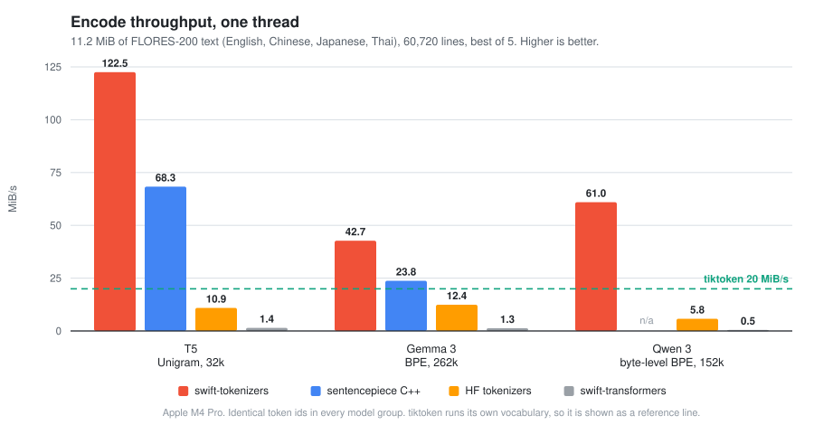
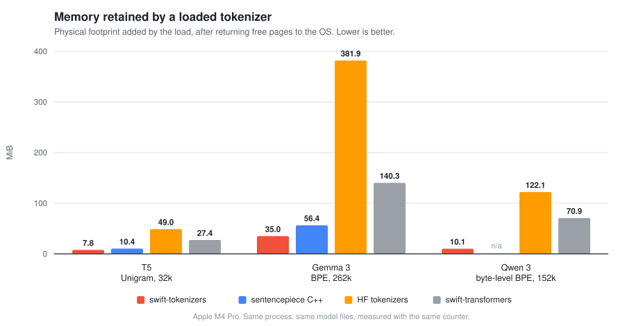

<p align="center">
  <h1 align="center">swift-tokenizers</h1>
  <p align="center">High-performance tokenizers in pure Swift.</p>
</p>

<p align="center">
  <a href="https://github.com/aleroot/swift-tokenizers/actions/workflows/ci.yml"></a>
  
  
  <a href="LICENSE"></a>
</p>

swift-tokenizers is a native Swift 6 implementation of the tokenizers used by today's language
models: byte-level and SentencePiece **BPE**, **Unigram**, **WordPiece** and **WordLevel**. It
loads `tokenizer.json` files published on the Hugging Face Hub, with single-sequence inference
checked against Hugging Face references. It ships as a drop-in replacement for the
`Tokenizers` product of
[swift-transformers](https://github.com/huggingface/swift-transformers), plugs seamlessly into
[mlx-swift-lm](https://github.com/ml-explore/mlx-swift-lm), and is the tokenizer behind
[Lampo](https://apps.apple.com/app/lampo/id6760648195).

```swift
import Tokenizers

let tokenizer = try AutoTokenizer.load(from: modelFolder)

let ids = tokenizer.encode(text: "Hello world")   // [9707, 1879]
let text = tokenizer.decode(tokens: ids)          // "Hello world"
```

## Highlights

- **Fast.** Faster than Google's SentencePiece C++ on its own benchmark corpus, and several
  times faster than every other implementation measured. See [Performance](#performance).
- **Tested against Hugging Face.** Whole-model ID/decode fixtures, pinned `tokenizers` 0.23.2
  component references, Unicode conformance, and regression tests. Local differential harnesses
  also check generated configurations and source offsets.
- **Broad inference support.** The model and pipeline component families listed below, plus
  added and special tokens, chat templates with tools, source offsets and O(1) vocabulary lookup.
  Nonzero BPE dropout, training, padding, truncation and pair encodings are out of scope.
- **Drop-in.** Same `Tokenizer`, `PreTrainedTokenizer`, `AutoTokenizer`, `Config` and
  `TokenizerError` API as swift-transformers; existing consumers compile unchanged.
- **Lean.** One dependency, [swift-jinja](https://github.com/huggingface/swift-jinja), for chat
  templates. No Hub client, no downloader. Every tokenizer is `Sendable`, and concurrent encodes
  on a single instance scale across cores without blocking.

## Installation

```swift
dependencies: [
    .package(url: "https://github.com/aleroot/swift-tokenizers", from: "1.0.0"),
],
targets: [
    .target(name: "MyApp", dependencies: [
        .product(name: "Tokenizers", package: "swift-tokenizers"),
    ]),
]
```

Requires Swift 6. Supports macOS 13, iOS 16, tvOS 16, watchOS 9 and visionOS 1.

## Usage

Point the library at a folder holding `tokenizer.json`, plus `tokenizer_config.json`,
`config.json` and a chat template file when present.

```swift
import Tokenizers

let tokenizer = try AutoTokenizer.load(from: modelFolder)              // synchronous
let tokenizer = try await AutoTokenizer.from(modelFolder: modelFolder) // async

// Encoding and decoding
let ids = tokenizer.encode(text: "Hello world", addSpecialTokens: true)
let tokens = tokenizer.tokenize(text: "Hello world")
let text = tokenizer.decode(tokens: ids, skipSpecialTokens: true)

// Vocabulary and special tokens
tokenizer.convertTokenToId("Hello")     // 9707
tokenizer.convertIdToToken(9707)        // "Hello"
tokenizer.eosTokenId, tokenizer.bosToken, tokenizer.unknownToken

// Source offsets: UTF-8 byte ranges in the original text, before normalization
let encoding = try tokenizer.encode(text: "Hello world", withOffsets: true)
let ranges = encoding.utf16Ranges(expandingToGraphemeClusters: true)

// Chat templates, with optional tool definitions
let prompt = try tokenizer.applyChatTemplate(messages: messages, tools: tools)
```

Messages are `[String: any Sendable]` dictionaries and tools follow the OpenAI function schema;
both render in the canonical key order of `transformers.utils.get_json_schema`, byte-identical to
Python for standard schemas. For tokenizer JSON you already hold in memory, use
`Config(tokenizerJSON:)`, which preserves byte-distinct vocabulary keys that Foundation's
`JSONDecoder` would merge through Unicode canonical equivalence.

## Supported components

| | |
|---|---|
| **Models** | byte-level and SentencePiece BPE (GPT-2, Llama 2 / 3, Qwen, Mistral, Gemma, DeepSeek, Phi, Falcon, Whisper, Cohere, RoBERTa, o200k ...), Unigram (T5, XLM-RoBERTa, multilingual-e5, bge-m3 ...), WordPiece (BERT, DistilBERT, MiniLM, bge, nomic ...), WordLevel |
| **Normalizers** | Sequence, Prepend, Replace, Lowercase, NFC, NFD, NFKC, NFKD, BertNormalizer, Precompiled, StripAccents, Strip, Nmt, ByteLevel |
| **Pre-tokenizers** | Sequence, ByteLevel, Split, Metaspace, Whitespace, WhitespaceSplit, Punctuation, Digits, BertPreTokenizer, CharDelimiterSplit, FixedLength, UnicodeScripts |
| **Post-processors** | TemplateProcessing, ByteLevel, RobertaProcessing, BertProcessing, Sequence |
| **Decoders** | Sequence, ByteLevel, ByteFallback, Fuse, Strip, Replace, Metaspace, WordPiece, BPEDecoder, CTC |

## Performance



Measured on Google's own SentencePiece benchmark corpus: 11.2 MiB of FLORES-200 sentences in
English, Chinese, Japanese and Thai, 60,720 lines, encoded line by line on one thread, best of 5.
Every implementation in a group reads the same vocabulary and emits **byte-identical token ids**
on all 60,720 lines, verified before timing.

| Model | swift-tokenizers | vs SentencePiece C++ | vs HF `tokenizers` |
|---|---:|---:|---:|
| T5, Unigram, 32k | 120.5 MiB/s | **1.8x** faster | 11.1x faster |
| Gemma 3, SentencePiece BPE, 262k | 42.8 MiB/s | **1.8x** faster | 3.4x faster |
| Qwen 3, byte-level BPE, 152k | 61.3 MiB/s | n/a | 10.6x faster |

`tiktoken` cannot load a Hub tokenizer, so it runs its own vocabulary over the same text: it
reaches 20.0 MiB/s (`cl100k_base`) and 19.4 MiB/s (`o200k_base`), which the chart marks as a
reference line.



A loaded tokenizer keeps 6 to 12 times less memory than Hugging Face's Rust core and less than
SentencePiece on both models it can load: 7.8 MiB against 10.4 MiB on T5, 35.0 MiB against
56.4 MiB on Gemma 3, even though the same 262k vocabulary arrives as a 31.8 MiB `tokenizer.json`
instead of a 4.5 MiB protobuf. The tables parsed out of the JSON live in page-backed buffers that
go straight back to the OS once the tokenizer is built.

English prose is friendlier to every engine. On a 1.15 MB document the same Qwen 3 tokenizer
reaches **231 MiB/s** single-threaded, against 55 MiB/s for `tiktoken` (`o200k_base`), 5.4 MiB/s
for Hugging Face's Rust core and 0.9 MiB/s for swift-transformers, and it loads its 10.9 MiB
`tokenizer.json` in **23 ms** against 97 ms.

Every tokenizer family, embedding and reranker models, end-to-end figures through mlx-swift-lm,
cold-cache runs, concurrency scaling, methodology and how to reproduce all of it:
**[docs/BENCHMARKS.md](docs/BENCHMARKS.md)**.

## Migrating from swift-transformers

The `Tokenizers` module is source-compatible; swap the package dependency:

```swift
// before
.package(url: "https://github.com/huggingface/swift-transformers", from: "1.3.0"),
.product(name: "Tokenizers", package: "swift-transformers"),

// after
.package(url: "https://github.com/aleroot/swift-tokenizers", from: "1.0.0"),
.product(name: "Tokenizers", package: "swift-tokenizers"),
```

- mlx-swift-lm's `#huggingFaceTokenizerLoader()` and `#adaptHuggingFaceTokenizer` macros work
  unchanged.
- `Config` now lives in `Tokenizers`; drop `import Hub` where that was all you needed.
- `AutoTokenizer.from(pretrained:)` becomes a download step followed by
  `AutoTokenizer.from(modelFolder:)`; `LanguageModelConfigurationFromHub(modelFolder:)` becomes
  `LocalModelConfiguration(modelFolder:)`.
- Pipeline component initializers are `init(config:) throws`.

## License

[Apache License 2.0](LICENSE).
